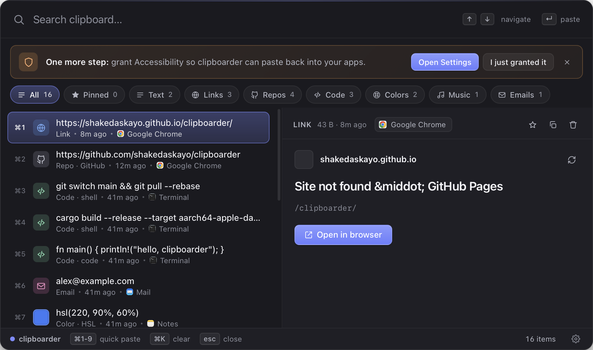

# Quickstart

## 1. First launch — grant Accessibility

The very first time clipboarder opens, you'll see an orange banner across the top:




Click **Open Settings**. macOS will jump straight to *System Settings → Privacy & Security → Accessibility*. Toggle `clipboarder` on (or click `+` and add it from `/Applications`).

Come back to clipboarder. The banner detects the change within a couple of seconds and flips to a green ✓:

> ✓ **Accessibility granted** · paste-back is now active.

You only do this once. clipboarder remembers across launches.

??? note "What if I skip it?"
    *Copy to clipboard* still works — selecting an item with Enter puts the content on your system clipboard. But the auto-paste step that synthesizes ⌘V into the previously-focused app needs Accessibility. Without it you'll have to press ⌘V yourself.

## 2. Open clipboarder

After install, clipboarder is running in the background. There's a tray icon in your menu bar (top right), and the global hotkey is armed.

## 3. Press `⌘⇧V`

From anywhere — Safari, VS Code, Slack, Mail — press `⌘⇧V`. The overlay floats in centered on screen.

If you don't see anything, check the tray icon and click *Show clipboarder*.

## 4. Search

Just start typing. clipboarder runs full-text search over your history as you type. Hostnames, file names, code keywords — all indexed.

```
Search          [ react        ]
─────────────────────────────────
⌘1  📄  const Component = () => …
⌘2  🔗  Link · github.com/facebook/react
⌘3  🔗  Repo · facebook/react
```

## 5. Navigate

| Key | Action |
|-----|--------|
| `↑` / `↓` | Move selection |
| `Enter` | Paste selected item into previously-focused app |
| `⌘1`–`⌘9` | Quick-paste the Nth result |
| `Esc` | Close the overlay |

## 6. Filter

Tap a chip in the row of categories below the search bar — **All**, **Pinned**, **Text**, **Links**, **Repos**, **Code**, **Images**, **Colors**, **Music**, **Video**, **PDFs**, **Emails**, **Files** — to show only that kind of content.

## 7. Pin what matters

Open the **Preview** pane (right side) and click the star to pin. Pinned items:

- Float to the top
- Survive `Clear history`
- Carry a small ⭐ in the row

## 8. Customize

Press `⌘,` (or click the gear in the bottom-right of the overlay) to open Settings:

- **Hotkey** — record any combination
- **Launch at login** — toggle on for always-on
- **History limits** — cap the size, auto-clear after N days
- **Privacy** — exclude apps like 1Password from being captured

→ [Keyboard shortcuts](../usage/shortcuts.md) · [Settings](../settings/index.md)
