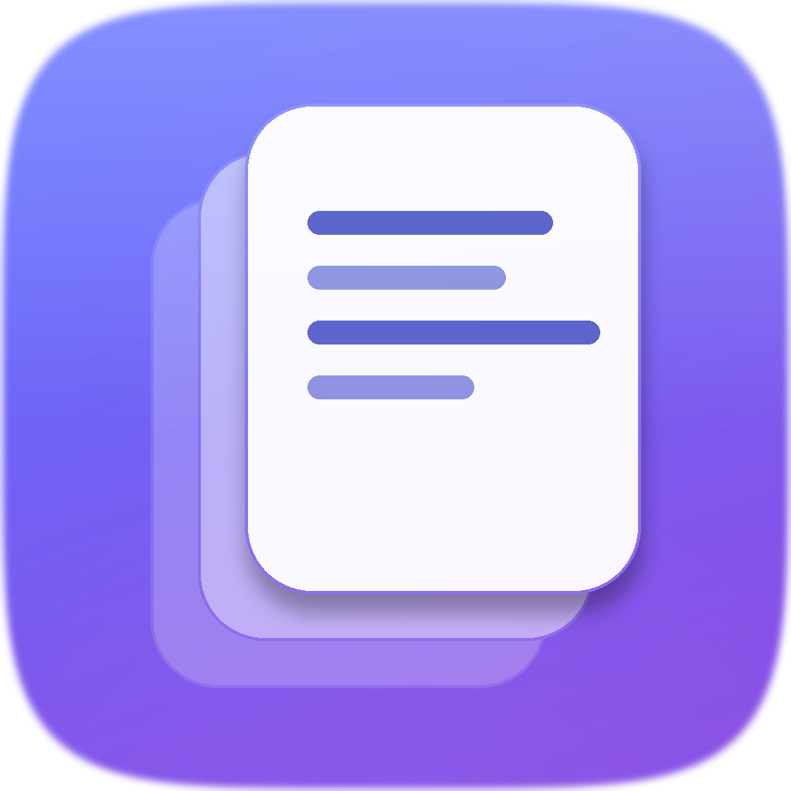
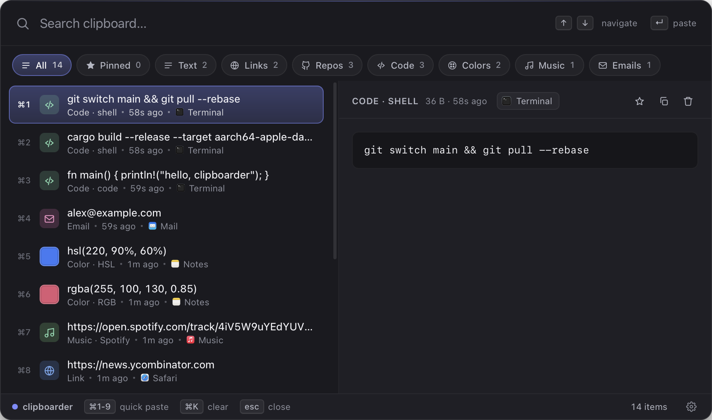
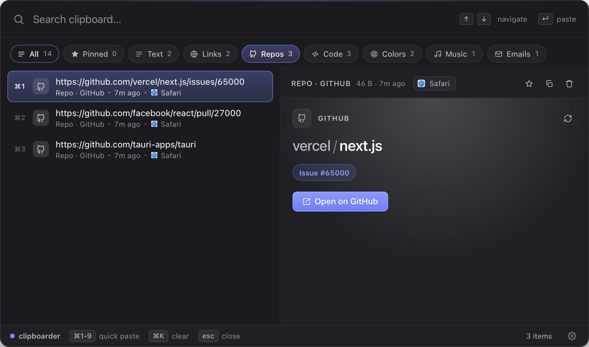
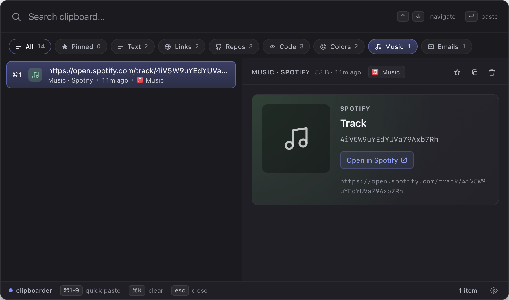
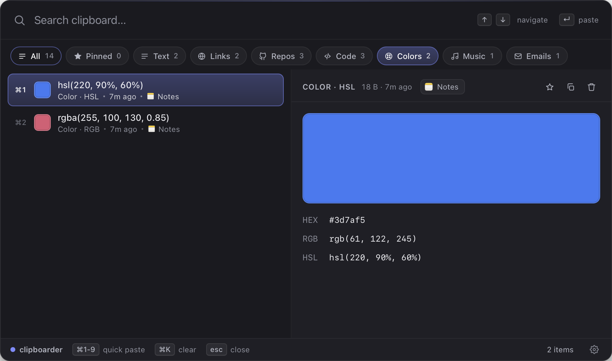
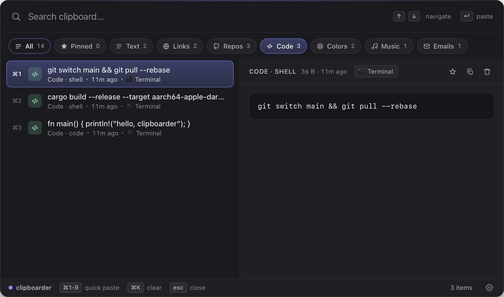
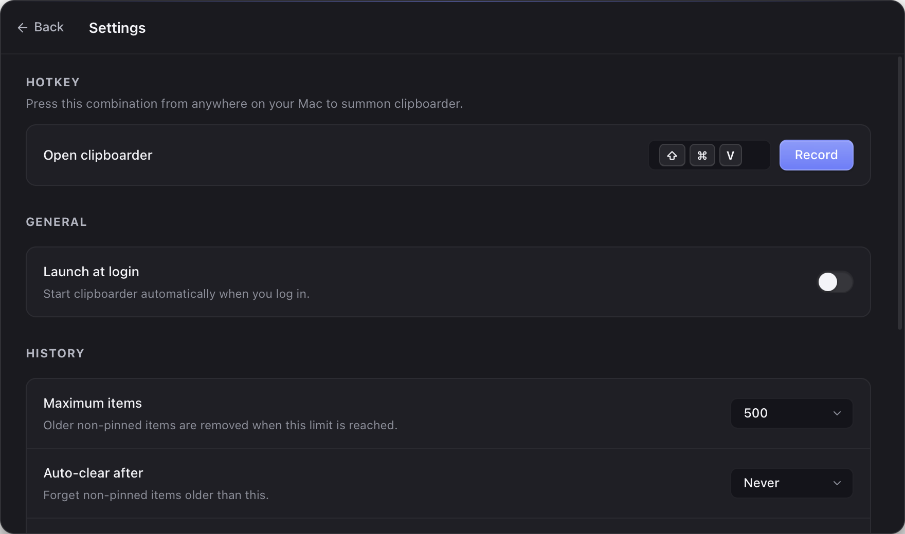

<div class="clipboarder-hero" markdown>



# clipboarder

<p class="tagline">A faster, smarter, more beautiful clipboard manager for macOS. Captures everything you copy — text, links, code, colors, PDFs, music — and makes it searchable in milliseconds.</p>

[Install](getting-started/installation.md){ .md-button .md-button--primary }
[Quickstart](getting-started/quickstart.md){ .md-button }

</div>

<div class="install-cmd" markdown>

```bash
curl -fsSL https://raw.githubusercontent.com/shakedaskayo/clipboarder/main/install.sh | bash
```

</div>

---



---

## Why clipboarder

<div class="feature-grid" markdown>

<div class="feature-card" markdown>
### Instant search
SQLite FTS5 with bm25 ranking. Sub-millisecond results across thousands of items, even on a cold cache.
</div>

<div class="feature-card" markdown>
### Smart classification
Every copy is auto-tagged at capture time: text, URL, email, code, color, image, file, PDF, music link, video link, repo.
</div>

<div class="feature-card" markdown>
### Rich previews
Color swatches with HEX/RGB/HSL. Inline PDF embed. Music/video cards for Spotify, Apple Music, YouTube, SoundCloud. Repo cards for GitHub/GitLab.
</div>

<div class="feature-card" markdown>
### Source app icons
Each row shows the real icon of the app you copied from — Safari, VS Code, Figma — extracted live via NSWorkspace.
</div>

<div class="feature-card" markdown>
### Quick-paste
`⌘1`–`⌘9` paste the top 9 results directly into the previously-focused app, no extra keystrokes.
</div>

<div class="feature-card" markdown>
### Private by default
All data stays local at `~/Library/Application Support/com.clipboarder.app/`. No telemetry. No cloud. No account.
</div>

</div>

---

## A preview for every kind

=== "Repos"

    

=== "Music"

    

=== "Colors"

    

=== "Code"

    

=== "Settings"

    

---

## How It Works

```
NSPasteboard  ─▶  Watcher  ─▶  Classify + hash  ─▶  SQLite + FTS5
                                                         │
       ⌘⇧V hotkey  ─▶  Tauri IPC  ─▶  React frontend  ─◀──┘
                            │
                            ▼
                    Paste-back via CGEventPost
                    into the previously-focused app
```

A Rust thread watches `NSPasteboard` change-count and reads every clipboard event. Content is classified, deduplicated, and persisted. The overlay is a frameless transparent Tauri window that floats above other apps and joins every macOS Space. Selecting an item writes it back to the pasteboard, hides the overlay, and synthesizes `⌘V` into the previously-focused app.

---

## Get Started

- **[Installation](getting-started/installation.md)** — one-liner installer or manual `.dmg`
- **[Quickstart](getting-started/quickstart.md)** — your first 60 seconds with clipboarder
- **[Keyboard shortcuts](usage/shortcuts.md)** — the moves that make it fast
- **[Settings](settings/index.md)** — every knob, explained

---

## Open Source

clipboarder is [MIT-licensed](https://github.com/shakedaskayo/clipboarder/blob/main/LICENSE) and lives on [GitHub](https://github.com/shakedaskayo/clipboarder).

- File a bug or request a feature in [Issues](https://github.com/shakedaskayo/clipboarder/issues)
- See [CONTRIBUTING](https://github.com/shakedaskayo/clipboarder/blob/main/CONTRIBUTING.md) for the development setup
